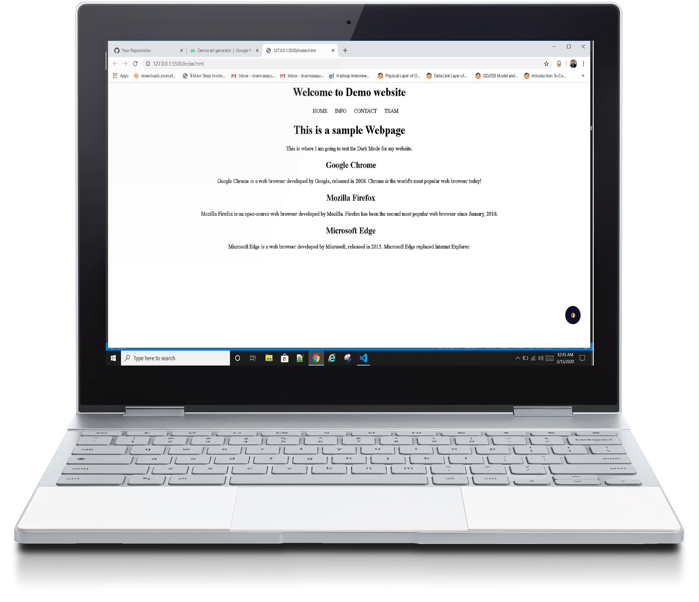
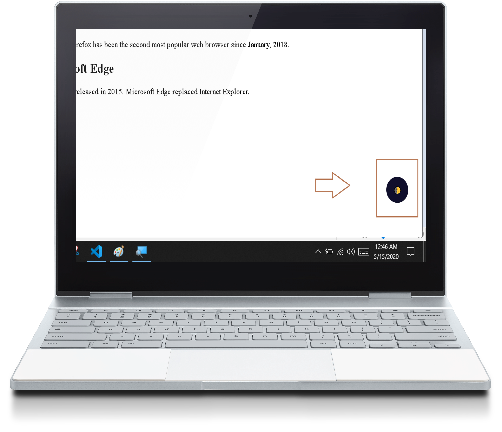
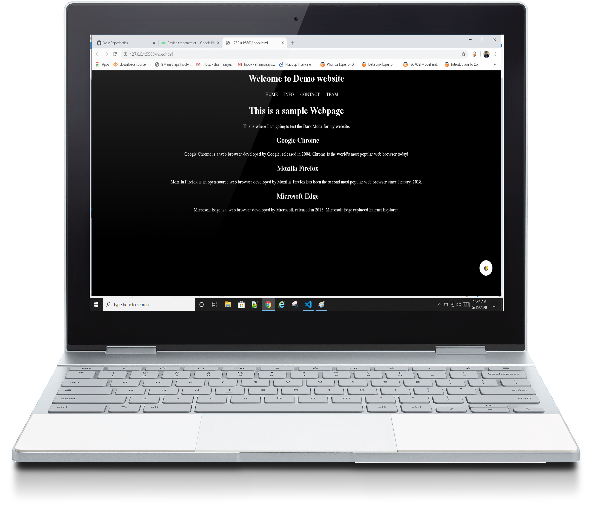
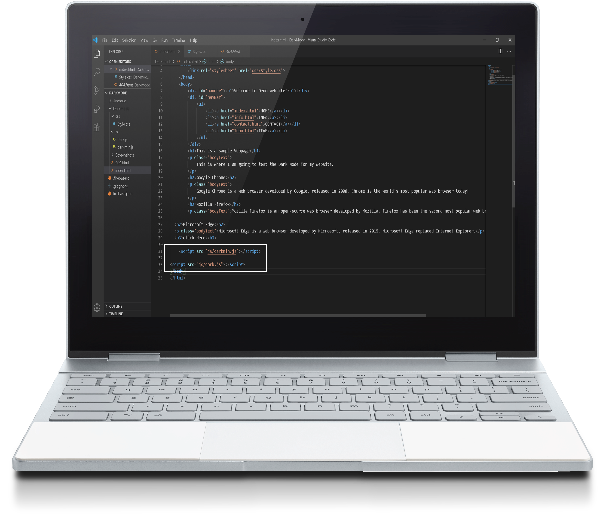

# Dark-Mode-Website-
Adding Dark Mode Toggle Feature to Any website (HTML, CSS, JavaScript) </br>
</br>
  


## Dark Mode
To bring Dark-mode to any of your websites. Just copy paste the snippet and you will get a widget to turn on and off the dark-mode. You can also use it without the widget programmatically. It also uses localstorage by default so your last setting will be remembered.

| Name | Demo |
| --- | --- |
| Dark Theme |[Preview](https://darkmodedemo.web.app) |


### Features 
- Easy to Use
- Appears automatically
- Saving users choice ( Optional)
- Auto Match OS.( Optional )
- Can be used programmatically without widget

## How to use
Dark Mode  is very easy to use, just copy-paste the following code to your webiste.

### using the JSDelivr CDN
Just add this code to your HTML page:
```html
<script src="js/darkmin.js"></script> // Javascript file ( Dark Mode)
<script>  new Darkmode().showWidget();   // Import Your JavaScript file here ( Options File)
</script>
// Import Your JavaScript file here 
// <Script src ="link of file"></script>
```


##  JavaScript
Make a new Javascript File and just copy-paste the following code.
Here are the option availables:
```javascript
var options = {
  bottom: '64px', // default: '32px'
  right: '32px', // default: '32px'
  left: 'unset', // default: 'unset'
  time: '0.5s', // default: '0.3s'
  mixColor: '#fff', // default: '#fff'
  backgroundColor: '#fff',  // default: '#fff'
  buttonColorDark: '#100f2c',  // default: '#100f2c'
  buttonColorLight: '#fff', // default: '#fff'
  saveInCookies: false, // default: true,
  label: '🌓', // default: ''
  autoMatchOsTheme: true // default: true // Check OS Theme while loading the website
}

const darkmode = new Darkmode(options);
darkmode.showWidget();
```


### Contact Us
* [LinkedIn](https://in.linkedin.com/in/sharmaayush981) 
* [Email](test1email320@gmail.com)
* [Twitter](https://twitter.com/i_ayush_sharma)

### MIT License

Copyright (c) 2020 Ayush Sharma

Permission is hereby granted, free of charge, to any person obtaining a copy
of this software and associated documentation files (the "Software"), to deal
in the Software without restriction, including without limitation the rights
to use, copy, modify, merge, publish, distribute, sublicense, and/or sell
copies of the Software, and to permit persons to whom the Software is
furnished to do so, subject to the following conditions:

The above copyright notice and this permission notice shall be included in all
copies or substantial portions of the Software.

THE SOFTWARE IS PROVIDED "AS IS", WITHOUT WARRANTY OF ANY KIND, EXPRESS OR
IMPLIED, INCLUDING BUT NOT LIMITED TO THE WARRANTIES OF MERCHANTABILITY,
FITNESS FOR A PARTICULAR PURPOSE AND NONINFRINGEMENT. IN NO EVENT SHALL THE
AUTHORS OR COPYRIGHT HOLDERS BE LIABLE FOR ANY CLAIM, DAMAGES OR OTHER
LIABILITY, WHETHER IN AN ACTION OF CONTRACT, TORT OR OTHERWISE, ARISING FROM,
OUT OF OR IN CONNECTION WITH THE SOFTWARE OR THE USE OR OTHER DEALINGS IN THE
SOFTWARE.
